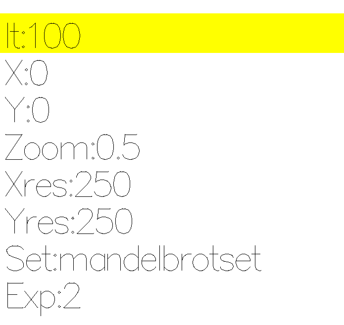
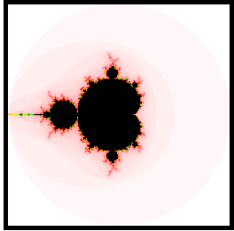

# Fractal visualization in Haskell

Authors: Eckerbom, Petter. Gällstedt, Axel. Mathiassen, Thomas.

---

### Aim of project

The aim of this project is to make a graphical representation of several different fractal sets in the complex number plane using the functional programming language Haskell. The primary focus was to visualize the mandelbrot set but the end product can also visualize a couple of variations of it namely the Tricorn set, The burningship set as well as one variation of the juliaset. This project was made as a group project in the course "**Program Design and Data Structures**" at Uppsala University.

---

### Dependencies

Several libraries and dependencies were used in the making of this project:

1. Graphics.Gloss ( and Graphics.Gloss.Interface.Pure.Game)
2. Data.Complex
3. Data.Word
4. Data.Char
5. Data.ByteString
6. Test.HUnit

---

### Usage

To start the program, you need to run the main function in Mandel.hs. In order to use the program you first need to understand how to navigate the menu and the different options. When you first open the program you will be greeted with a simple menu where you can choose various options for the fractal you want to visualize, an image of the menu can found below. To change a value you simply use your keyboard inputs. If your input is valid, the value in the highlighted field will change. To move up and down in the menu, you simply use the up- and down button respectively. The options you can change is as follows:

1. **It:** This represents the max number of iterations each pixels will be checked by. Increasing this can give you more detail and range in colors but may also dramatically increase the time it takes to generate the fractal. In this field you should type in any whole number larger than 0.
2. **X:** The x-coordinate you want to be centered on the screen. The fractals reside between -2 and 2 so it is advised to keep your coordinates within this range. Decimal numbers and negative numbers are allowed.
3. **Y:** Same as X but for the y-coordinate.
4. **Zoom:** How much you want to zoom on a certain point. 0.5 allows you to see the entire span between -2 and 2, but you can choose any values. When zooming in a lot (I.e. a large number as zoom), it can be good to also set "It" to a larger number as the image might not be very detailed otherwise.
5. **Xres:** The width of the fractal generated on screen. If you choose a resolution larger than the standard window size (700 x 700), you will need to scale up the window to see the entire picture. This should preferably be done before attempting to generate the fractal.
6. **Yres:** Same as Xres but height instead of width.
7. **Set:** Specify the type of set you want to generate. The different options are: **mandelbrotSet**, **burningShipSet**, **juliaSet** and **tricornSet**. It needs to be spelled exactly as above (including capital letters). Any misspellings or other words will simply result in the Mandelbrot set.
8. **Exp:** This alters the exponent used in the fractal function, the standard Mandelbrot uses 2, but can work with any exponent, yielding different visual results.

The menu should look like this upon starting the program:

### Done with settings?

When you are satisfied with your settings you can press Enter to start rendering. Always double-check your settings, because you can not stop the rendering mid way. Be patient; depending on the values you set this can take a while. \\ Once the image is rendered, you can now start to explore the fractal. Zoom in and out on certain areas by pointing on the point you want to zoom in/out on and use left- and right click respectively. If you wish to zoom in more than the standard factor of 1.5, you can simply re-open the menu with Enter and manually set the zoom. Keep in mind that all actions will require the program to recalculate the relevant area of the fractal. This means that setting a large resolution and iterations will not only result in a slow initial rendering, but will also cause zooming to be slower.

With unchanged settings the initial render should look like this:

---

### Futurework/Improvements

**Slow**

Our method of rendering fractals proved to be very slow, this was party due to the nature of fractals but also the limitations of working with functional programming and our inexperience with it. Something that adds to this is also that the play function of gloss wants to regenerate the fractal over and over, even if nothing changed meaning even actions that should be relatively fast (such as opening the menu) has to wait for the previous render of the fractal to finish and can therefore take quite a lot of time depending on the settings. We attempted to fix this by saving the fractal in the RAM memory, so that the bitmap could easily be rendered almost instantly after the initial calculation. However, we were unable to produce the desired results, even after trying 3 different libraries (MemoTrie, UglyMemo and StableMemo) that could potentially have provided the solution to this problem.

**Set color gradient**

One major improvement that is possible is the ability to pick different color palettes. Our program uses just one, with contrasting colors close to each other to highlight the fractal patterns. There are, however, many more interesting color schemes that can be chosen. One possibility is using the colors of the rainbow, to create the smoothest gradient possible.

**Safer and more interactive menu**

The current menu does its job but is quite basic, it would be nice to be able to highlight different fields with the mouse instead of having to navigate with the up and down button. Other features that would be nice to implement would be the ability change any characters in the input boxes, rather than just the last one, as it can be annoying to change long inputs. Additionally some more safeguards could be put in place so that the user can't give invalid values. There are already a few safeguards, but the user can easily crash the program. For example, by using multiple dots in a number field.

---
